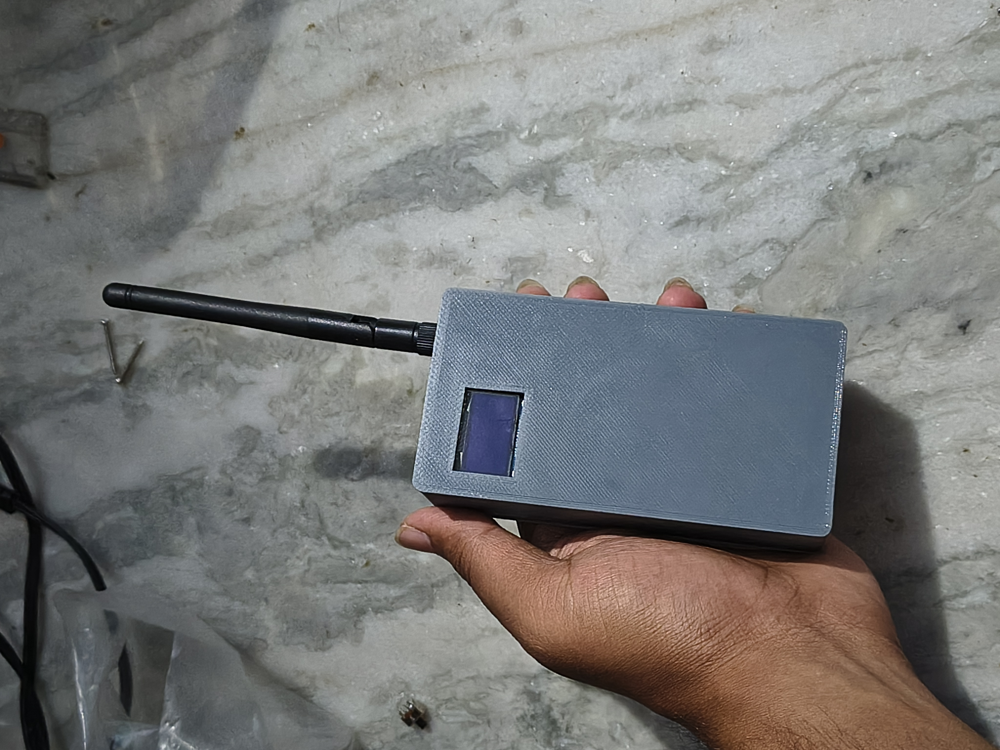

# Custom Meshtastic Port: ESP32 + SX1278 LoRa Module

Meshtastic is an open source, off-grid, decentralized mesh communication platform built on affordable, low-power hardware.

## Project Gallery


*Completed custom Meshtastic device with 3D printed enclosure*


*Multiple devices communicating in a mesh network*

## Custom Hardware Port

This repository contains my custom port of the Meshtastic firmware for non-standard ESP32 and SX1278 LoRa module combinations. Instead of using officially supported boards, I've adapted the firmware to work with generic ESP32 modules and SX1278 LoRa radios.

### Hardware Used

- Generic ESP32 development board (ESP32-WROOM-32)
- SX1278 LoRa module (operating in 868MHz/915MHz/433MHz depending on your region)
- 18650 Li-ion battery (for portable use)
- TP4056 battery charging module
- 0.96" SSD1306 OLED display
- Optional: NEO-6M GPS module
- 3D printed enclosure

### Build Process


*Internal assembly showing component arrangement*


*Soldering the connections between ESP32 and SX1278*


*Front view of device during assembly*


*Back view of device during assembly*

### Custom Wiring Configuration

| ESP32 Pin | SX1278 Pin | Notes |
|-----------|------------|-------|
| GPIO5     | SCK        | SPI Clock |
| GPIO19    | MISO       | SPI MISO |
| GPIO27    | MOSI       | SPI MOSI |
| GPIO18    | NSS/CS     | Chip Select |
| GPIO14    | RESET      | Reset pin |
| GPIO26    | DIO0       | Interrupt pin |
| 3.3V      | VCC        | Power (3.3V only!) |
| GND       | GND        | Ground |

**Display Connections:**
- GPIO21 - SDA
- GPIO22 - SCL

**GPS Connections (Optional):**
- GPIO16 - GPS RX
- GPIO17 - GPS TX

## Porting Process

### 1. Creating a Custom Variant

I created a custom variant definition to match my hardware pinout:

```cpp
// Custom variant definition in firmware/custom_board/variant.h
#define PIN_SPI_SCK 5
#define PIN_SPI_MOSI 27
#define PIN_SPI_MISO 19
#define PIN_SPI_SS 18
#define PIN_LORA_RESET 14
#define PIN_LORA_DIO0 26
#define I2C_SDA 21
#define I2C_SCL 22
#define BUTTON_PIN 0      // Boot button
#define BATTERY_PIN 35    // Battery ADC monitoring pin
#define GPS_RX_PIN 16
#define GPS_TX_PIN 17
```

### 2. Custom PlatformIO Configuration

I created a custom platformio.ini file:

```ini
[env:custom_esp32]
platform = espressif32
board = esp32dev
framework = arduino
build_flags = 
    ${arduino_base.build_flags}
    -D ARDUINO_ARCH_ESP32
    -D HAS_BLUETOOTH=1
    -D HAS_SCREEN=1
    -D USE_SH1106=0
    -D USE_SSD1306=1
    -D SCREEN_WIDTH=128
    -D SCREEN_HEIGHT=64
    -D HAS_GPS=1
    -D HAS_BUTTON=1
    -D LORA_SCK=5
    -D LORA_MISO=19
    -D LORA_MOSI=27
    -D LORA_CS=18
    -D LORA_RESET=14
    -D LORA_DIO0=26
lib_deps =
    ${arduino_base.lib_deps}
```

### 3. Radio Module Modifications

I modified the RadioInterface initialization to recognize my generic SX1278 module:

```cpp
// Modified radio detection in src/detect/LoRaRadioType.h
if (!sx1278) {
    // Custom SX1278 detection
    sx1278 = new Arduino_LORA(LORA_CS, LORA_DIO0, LORA_RESET, LORA_SCK, LORA_MISO, LORA_MOSI);
    if (sx1278->begin(BANDWIDTH, SPREADING_FACTOR, CODING_RATE, FREQUENCY, SYNC_WORD)) {
        radioType = meshtastic_RadioType_SX1278;
        return sx1278;
    }
}
```

## Building and Flashing the Custom Port

1. Clone this repository
2. Install PlatformIO
3. Build the firmware:

```bash
pio run -e custom_esp32
```

4. Connect your ESP32 via USB and flash:

```bash
pio run -e custom_esp32 -t upload
```

## Configuration

After flashing, connect to your device using:

1. The Meshtastic mobile app ([Android](https://play.google.com/store/apps/details?id=com.geeksville.mesh) or [iOS](https://apps.apple.com/us/app/meshtastic/id1586432531))
2. The [Meshtastic web interface](https://meshtastic.org/app)
3. Command-line tools with `pip install meshtastic`

## Features

- Long-range mesh communication (up to 5km line-of-sight)
- Bluetooth connection for configuration
- Optional GPS location tracking
- Encrypted messaging
- Low power consumption for extended battery life
- Automatic message routing
- Position sharing between nodes
- Supports various channels & modulation schemes

## Troubleshooting Custom Hardware

- **Radio not detected**: Verify SPI connections and try different RESET timing
- **Display not working**: Check I2C address (0x3C or 0x3D typical for SSD1306)
- **GPS not acquiring**: Ensure proper UART connections and visibility to sky
- **Poor battery life**: Adjust `power.h` settings to optimize sleep modes

## License

This project is licensed under the GNU General Public License v3.0 - see [LICENSE](LICENSE) for details.

## Acknowledgments

- The Meshtastic project for the original firmware
- The open-source community for support and testing
